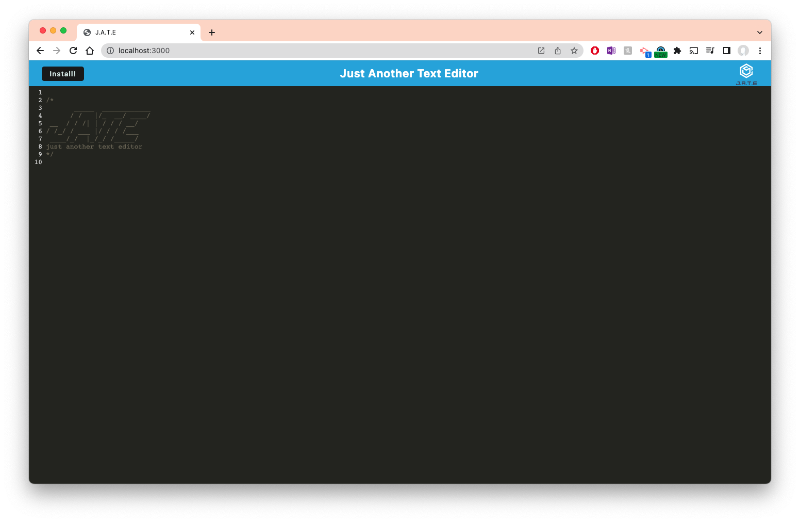

# PWA Text Editor

## Description

A simple text editor progressive web application (PWA) that stores data, works offline, and is installable

## Table of Contents

- [License](#license)
- [Questions](#questions)

## License

## Questions

If you have any questions, please contact me at [mrbenjamincha@gmail.com](mailto:mrbenjamincha@gmail.com).\
[GitHub](https://github.com/bencha27)
